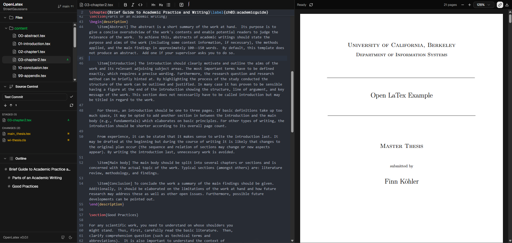

# OpenLaTex

Local, filesystem-backed LaTeX editor with live preview. Edit `.tex` projects on disk, auto-reload when external tools change files, and preview compiled PDFs — all in the browser.



## Why OpenLaTex?

I wanted a proper LaTeX editor that runs **locally** — no Overleaf, no cloud dependency, full control over my files. The key idea: because the editor works directly on the filesystem with live file watchers, you can use an LLM in VS Code (Copilot, Claude, etc.) to proofread or edit your `.tex` files and see the changes reload instantly in the editor and PDF preview. Meanwhile you can also use the LaTex editor and write your paper directly in the WebUI and it will sync with disk automatically. It turns your local dev environment into a LaTeX writing workflow where AI tools, version control, and the editor all work together seamlessly.

Git integration is built in so you can use the same version control workflow you already know — branch, commit, push, pull — making it straightforward to collaborate on research papers with other researchers, all without leaving your local setup.

## Background

OpenLaTex is a fork of [open-prism](https://github.com/assistant-ui/open-prism) (MIT), which was an AI-assisted, browser-storage-backed LaTeX editor using OpenAI, assistant-ui, and Upstash Redis for rate limiting. Documents lived in IndexedDB with no connection to the local filesystem.

The fork completely rearchitected the project into a **local-first, filesystem-backed editor** designed to run alongside VS Code on the same `.tex` project directory. Here's what changed:

### What was removed
- **All AI integration** — OpenAI SDK, assistant-ui chat interface, AI drawer, rate limiting, Upstash Redis
- **Browser storage** — IndexedDB document store replaced with real filesystem operations
- **Cloud dependencies** — No API keys, no hosted services, no deployment concerns

### What was added
- **Filesystem layer** — Chokidar file watcher with SSE streaming, sandboxed path resolution, echo suppression for write-through edits
- **Disk-backed editing** — Every keystroke debounce-writes to disk (300ms); every external file change auto-reloads the editor buffer with cursor preservation
- **Git integration** — Branch indicator, file status colors (VS Code-style), Source Control panel with stage/unstage/commit/pull/push
- **Three Zustand stores** replacing the single document store — `fs-store` (file tree), `editor-store` (active file + buffer), `pdf-store` (compile output), plus `git-store`
- **Recursive file tree sidebar** with collapsible panels (Files, Source Control, Outline)
- **Table of Contents** parsed from LaTeX section commands, linked to PDF page navigation
- **Cached PDF** on startup — skips recompilation if the cached PDF is newer than all source files
- **Compile-from-disk** — The compile route reads source files from the project directory instead of receiving them from the browser
- **Security hardening** — Path sandboxing (`resolveInProject`), `execFile` instead of `exec` for Git commands, `.openlatex/` build directory with auto-generated `.gitignore`

### What was kept
- **CodeMirror 6 editor** with LaTeX syntax highlighting and one-dark theme
- **react-pdf preview** with zoom controls
- **latex-api backend** (Hono + pdflatex) — completely unchanged from the original
- **shadcn/ui component library**, Tailwind CSS, Next.js framework

## Features

### Editor
- **CodeMirror 6** — LaTeX syntax highlighting, one-dark theme, undo/redo history
- **Formatting toolbar** — Bold, italic, headings, lists, code, images, colors
- **Find & replace** — `Ctrl+F` / `Cmd+F` search panel with match navigation
- **Sticky section headers** — Shows current `\section` / `\begin{...}` context at the top of the editor
- **Image preview** — Click a `.png` / `.jpg` / `.jpeg` to view it inline with zoom controls
- **Debounced write-through** — Every edit saves to disk within 300ms

### PDF Preview
- **Live auto-compile** — PDF rebuilds automatically when any source file changes (500ms debounce)
- **Zoom controls** — 50% to 400% scale, plus increment/decrement buttons
- **Scroll sync** — Table of Contents clicks scroll the PDF to the matching page via outline map
- **Compile error log** — Collapsible build output panel shows `pdflatex` errors; previous PDF stays visible
- **Download** — One-click PDF download from the toolbar
- **Cached PDF** — On startup, loads the last-compiled PDF instantly if it's still fresh

### Sidebar
- **Recursive file tree** — Expandable directories, file icons by type, click to open
- **Table of Contents** — Parsed from `\part`, `\chapter`, `\section`, `\subsection`, `\subsubsection` in the active file; click to scroll the PDF
- **Collapsible panels** — Files, Source Control, and Outline panels resize and collapse independently

### Git Integration
- **Auto-detection** — Detects if `PROJECT_DIR` is a Git repository on startup
- **Branch indicator** — Current branch name + ahead/behind badges (`↑2 ↓1`) in the sidebar header
- **File status colors** — VS Code-style decorations in the file tree:
  - Yellow = modified (unstaged), Green = staged, Dark green = untracked, Red = deleted/conflict
  - Single-letter badges: `M`, `A`, `?`, `D`, `C`, `R`
  - Directories inherit the most severe child status
- **Source Control panel** — Staged Changes, Changes, and Untracked sections with per-file stage/unstage buttons
- **Commit** — Commit message input with Enter-to-commit
- **Pull / Push** — One-click buttons (shown when a remote is configured)
- **Live refresh** — Git status updates on every file change (debounced 1s) and polls every 3s for external git operations (`git reset`, `git stash`, etc.)

### Filesystem Sync
- **Disk is source of truth** — The editor never holds state that isn't on disk
- **Chokidar file watcher** — SSE stream pushes `add` / `change` / `unlink` events to the browser in real-time
- **External edit auto-reload** — When another tool (VS Code, CLI, Claude) edits a file, the editor reloads the buffer and preserves cursor position
- **Echo suppression** — Write-echo tracker (100ms window) prevents the editor's own saves from bouncing back through the watcher
- **Reconnect with backoff** — SSE disconnects retry at 1s → 2s → 5s → 5s; tree re-syncs on reconnect

### General
- **Dark / Light / System theme** — Cycle with the toggle in the sidebar footer
- **Resizable panels** — Three-pane layout (sidebar, editor, preview) with drag-to-resize handles
- **Swap editor ↔ preview** — Hover the divider and click the swap button
- **Keyboard shortcuts** — `Ctrl+S` compile, `Ctrl+F` find, standard undo/redo
- **Toast notifications** — Non-intrusive feedback for errors and git actions via Sonner

## Quick Start

```bash
# Install dependencies
pnpm install

# Configure environment
cp apps/web/.env.example apps/web/.env.local
# Edit apps/web/.env.local — set PROJECT_DIR to your LaTeX project directory.

# Start the LaTeX compiler service (in one terminal)
# Option A — Docker (recommended):
cd apps/latex-api && docker build -t latex-api . && docker run -p 3001:3001 latex-api

# Option B — Local TeX Live (requires pdflatex on your PATH):
# cd apps/latex-api && pnpm dev

# Start the editor (in another terminal)
pnpm dev:web
```

Open [http://localhost:3000](http://localhost:3000). Keep VS Code open on the same `PROJECT_DIR` — edits in either tool flow to the other via filesystem watching.

### Environment Variables

| Variable | Required | Default | Description |
|----------|----------|---------|-------------|
| `PROJECT_DIR` | Yes | — | Absolute or relative path to the LaTeX project root |
| `LATEX_API_URL` | No | `http://localhost:3001` | URL of the latex-api compilation service |

## Architecture

```
Browser (Next.js client)
  ├── File Tree ← fs-store (Zustand)
  ├── CodeMirror Editor ← editor-store (Zustand, debounced write-through)
  ├── PDF Preview ← pdf-store (Zustand)
  └── Source Control ← git-store (Zustand, polls + event-driven)
        │
        │  fetch() / SSE
        ▼
Next.js Server (apps/web)
  ├── /api/fs/list      — Recursive file tree
  ├── /api/fs/read      — File content (text or base64)
  ├── /api/fs/write     — Write-through with echo suppression
  ├── /api/fs/watch     — SSE stream (chokidar)
  ├── /api/compile      — Gathers sources, proxies to latex-api
  ├── /api/pdf/cached   — Serves cached PDF if fresh
  ├── /api/git/info     — Branch, remote, last commit, ahead/behind
  ├── /api/git/status   — Porcelain file statuses
  ├── /api/git/stage    — git add
  ├── /api/git/unstage  — git restore --staged
  ├── /api/git/commit   — git commit -m
  ├── /api/git/pull     — git pull
  └── /api/git/push     — git push
        │
        │  POST /builds/sync
        ▼
latex-api (apps/latex-api, Hono) — unchanged
  └── Spawns pdflatex / xelatex / lualatex, returns PDF bytes
```

### Security

- **Path sandboxing** — All filesystem operations validate paths via `resolveInProject()`, rejecting traversal (`..`), absolute paths, null bytes, and symlink escapes
- **No shell injection** — Git commands use `execFile` (args as array), not `exec`
- **`.openlatex/` build directory** — Auto-created with `.gitignore` containing `*` so build artifacts stay out of version control

## Project Structure

```
OpenLaTex/
├── apps/
│   ├── web/                    # Next.js 16 frontend + API routes
│   │   ├── app/api/            # FS, Git, Compile, PDF API routes
│   │   ├── components/         # UI (sidebar, editor, preview, shadcn/ui)
│   │   ├── hooks/              # use-fs-startup, use-keyboard-shortcuts
│   │   ├── lib/fs/             # Sandbox, echo suppression, watcher, clients
│   │   ├── lib/git/            # Git runner (server), Git client (browser)
│   │   ├── stores/             # Zustand: fs-store, editor-store, pdf-store, git-store
│   │   └── styles/             # Tailwind CSS v4
│   └── latex-api/              # Hono API — spawns pdflatex (unchanged from fork)
├── docs/                       # Design specs, plans, manual test plan
├── biome.json                  # Biome linter
└── turbo.json                  # Turborepo config
```

## Tech Stack

| Layer | Technology |
|-------|-----------|
| Framework | Next.js 16, React 19 |
| Editor | CodeMirror 6, codemirror-lang-latex |
| PDF | react-pdf, pdfjs-dist |
| State | Zustand 5 |
| UI | shadcn/ui (Radix UI), Tailwind CSS v4, Lucide icons |
| File watching | chokidar 4 |
| Compiler backend | Hono, pdflatex / xelatex / lualatex |
| Build | Turborepo, pnpm workspaces, TypeScript (strict) |
| Testing | Vitest |

## Contributing

See [CONTRIBUTING.md](./CONTRIBUTING.md) for development setup and contribution guidelines.

## License

[MIT](./LICENSE)
